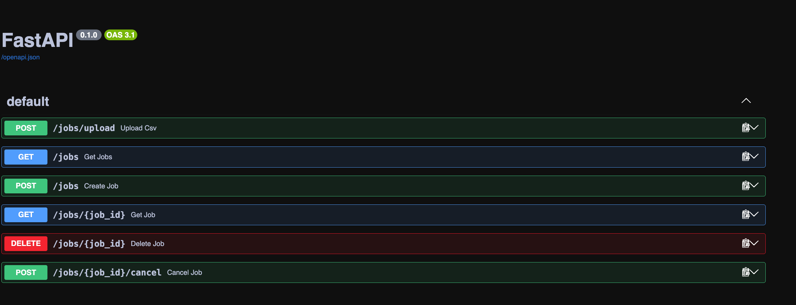
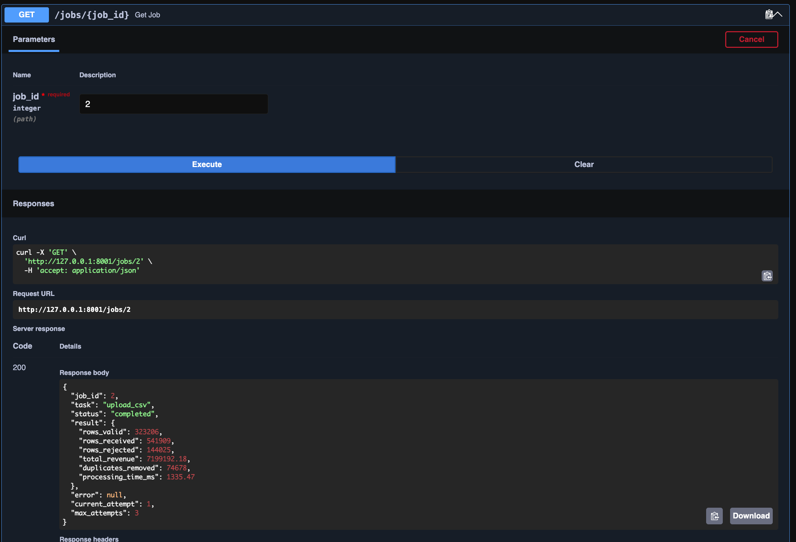
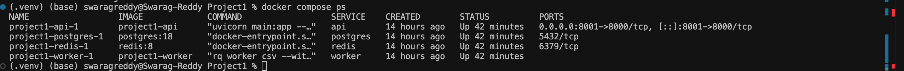

# Sales Processing Service

An asynchronous backend service for processing large CSV sales datasets using FastAPI, PostgreSQL, Redis, and RQ.

The service accepts CSV uploads, queues processing jobs asynchronously, validates and deduplicates sales records, calculates aggregate revenue, and exposes job lifecycle and result APIs.

## Tech Stack

- Python 3.11
- FastAPI
- PostgreSQL
- SQLAlchemy
- Alembic
- Redis
- RQ
- Docker / Docker Compose
- Pytest

## Architecture

```text
Client
  |
  v
FastAPI
  |
  +----> PostgreSQL
  |        Job state
  |
  +----> Redis Queue
             |
             v
          RQ Worker
             |
             v
        CSV Processor
             |
             v
         PostgreSQL

FastAPI and the worker share a Docker volume for uploaded CSV files.
```

PostgreSQL is the source of truth for job lifecycle state, while Redis/RQ handles asynchronous job delivery.

## Features

- Asynchronous CSV processing
- PostgreSQL-backed job lifecycle tracking
- Redis/RQ background job queue
- Retry handling for temporary failures
- Permanent vs retryable failure handling
- Job cancellation
- Row-level job locking to prevent conflicting state updates
- CSV file type and size validation
- Invalid-row rejection
- Duplicate record removal
- Revenue aggregation
- Dockerized multi-service architecture
- Alembic database migrations
- Environment-based configuration
- Automated processor and API validation tests

## Demo

### REST API

FastAPI exposes endpoints for CSV ingestion, job retrieval, lifecycle management, deletion, and cancellation.



### Real-World Dataset Processing

Processed 541,909 retail records in approximately 1.33 seconds of processor execution time.



### Dockerized Services

The API, RQ worker, PostgreSQL, and Redis run as separate services using Docker Compose.




## Job Lifecycle

```text
pending
   |
   v
processing
   |
   +----> completed
   |
   +----> retrying ----> processing
   |
   +----> failed

pending/retrying ----> cancelled
```

## CSV Format

Uploaded CSV files must contain:

```csv
customer_id,product,quantity,price
1,Laptop,2,100
2,Mouse,3,25
```

Rows with invalid values such as empty required fields, non-numeric values, non-positive quantities, or non-positive prices are rejected during processing.

## Running with Docker

Build and start the services:

```bash
docker compose up -d --build
```

Run database migrations:

```bash
docker compose exec api alembic upgrade head
```

Verify the containers:

```bash
docker compose ps
```

The API documentation is available at:

```text
http://127.0.0.1:8001/docs
```

## Upload a CSV

```bash
curl -X POST \
  -F "file=@sample.csv" \
  http://127.0.0.1:8001/jobs/upload
```

Example response:

```json
{
  "job_id": 1,
  "status": "pending",
  "rq_job_id": "csv-job-1"
}
```

## Retrieve Job Status

```bash
curl http://127.0.0.1:8001/jobs/1
```

Completed jobs contain processing statistics such as:

```json
{
  "status": "completed",
  "result": {
    "rows_received": 541909,
    "rows_valid": 323206,
    "rows_rejected": 144025,
    "duplicates_removed": 74678,
    "total_revenue": 7199192.18,
    "processing_time_ms": 1335.47
  },
  "current_attempt": 1,
  "max_attempts": 3
}
```

## Performance Benchmark

The service was tested using the UCI Online Retail dataset containing 541,909 transaction rows.

| Metric | Result |
|---|---:|
| Rows processed | 541,909 |
| Run 1 | 1.335 s |
| Run 2 | 1.324 s |
| Average processing time | ~1.33 s |
| Processor throughput | ~407K rows/sec |

For resume-level reporting, the conservative benchmark is approximately **400K rows/sec**.

The throughput measurement represents CSV processor execution time and does not include HTTP upload time, queue waiting time, or other end to end infrastructure latency.

## Testing

Run:

```bash
python -m pytest -v
```

Current test coverage includes:

- valid CSV processing
- invalid row rejection
- duplicate removal
- missing required columns
- empty datasets
- invalid file types
- empty uploads
- upload size limits

## Reliability Design

The service separates durable job state from queue delivery:

```text
PostgreSQL = source of truth
Redis/RQ   = job delivery mechanism
```

This allows cancellation state to remain durable even if Redis becomes temporarily unavailable. Workers verify database state before processing jobs, preventing cancelled jobs from being executed after queue recovery.

Database failures during job creation also trigger compensating cleanup so uploaded files are not left orphaned.

## Project Structure

```text
Project1/
├── alembic/
├── services/
│   ├── job_state.py
│   ├── processor.py
│   └── tasks.py
├── tests/
├── config.py
├── database.py
├── job_queue.py
├── main.py
├── models.py
├── schemas.py
├── Dockerfile
├── docker-compose.yml
├── requirements.txt
└── README.md
```